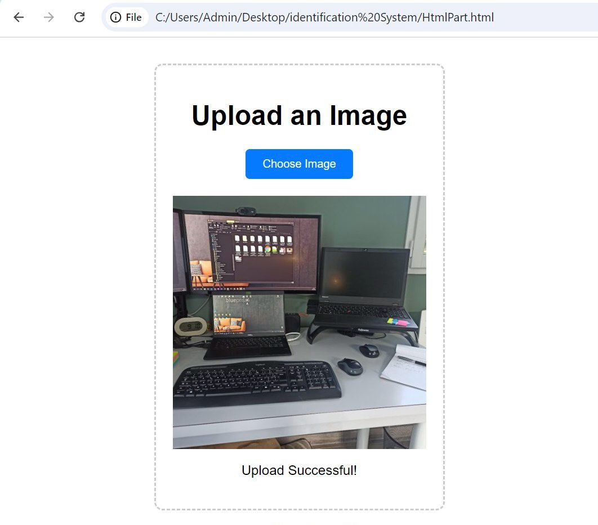
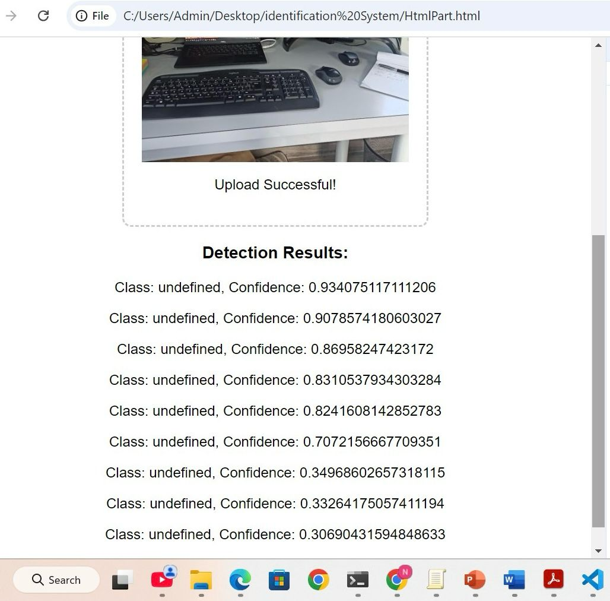
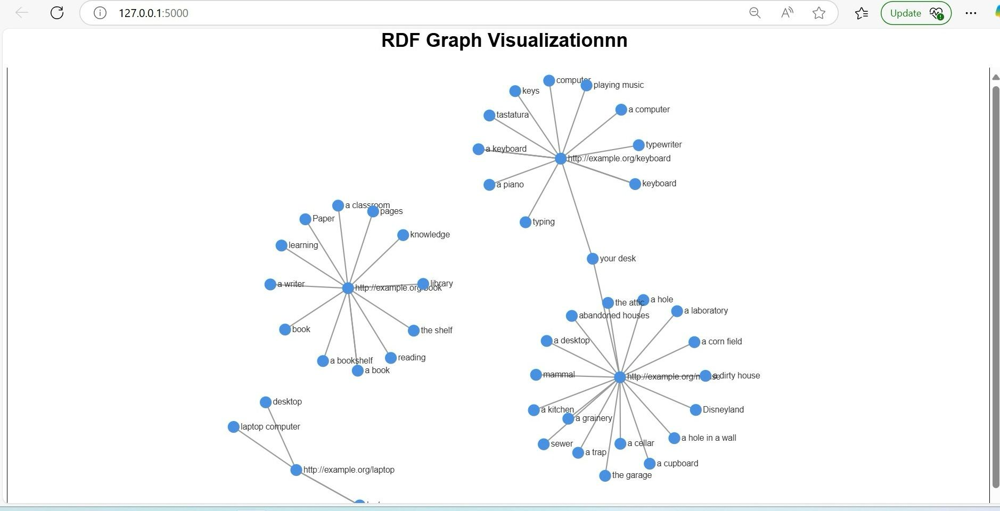
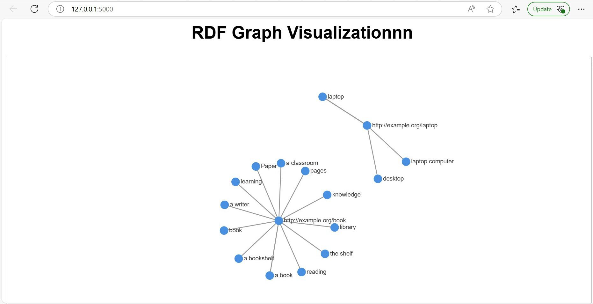
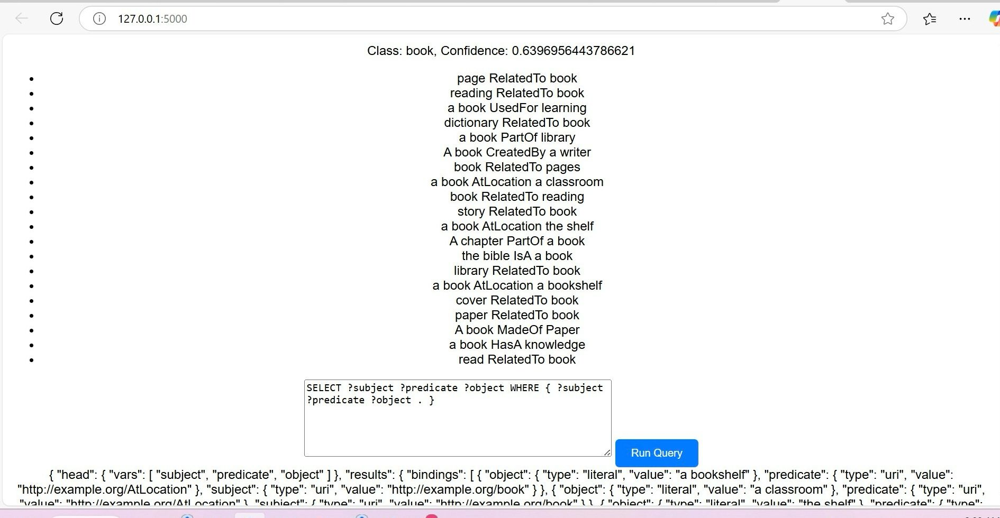
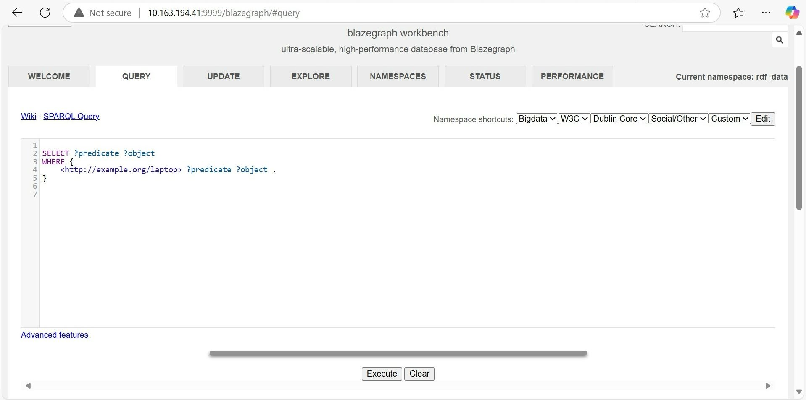
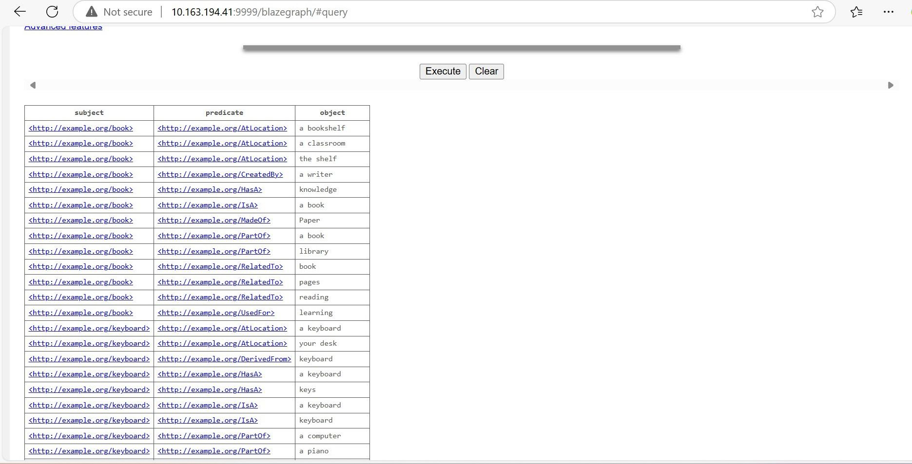

# RDF-Based Image Classification and Visualization with ConceptNet

## Overview
This project integrates **YOLOv8**, **ConceptNet**, and **Blazegraph RDF store** to classify objects in images and link them to semantic concepts. It allows visualization and querying of RDF data using **SPARQL**.

## Features
- **Object detection** using YOLOv8.
- **Concept linking** with ConceptNet API.
- **RDF generation** and storage in Blazegraph.
- **SPARQL querying** for structured data retrieval.
- **Graph visualization** of RDF relationships.
- **RDF files** are automatically stored in the output/ folder.

## Installation

### 1: Clone the Repository
```sh
git clone https://github.com/Siloya/SemanticImageClassification-YOLO-RDF-ConceptNet-SPARQL.git
cd SemanticImageClassification-YOLO-RDF-ConceptNet-SPARQL
```
### 2: install Dependencies
```sh
pip install -r requirements.txt
```
### 3: Start the Blazegraph SPARQL Database
Ensure Blazegraph is running on localhost:9999. If you don’t have Blazegraph installed:
```sh
java -server -Xmx4g -jar blazegraph.jar
```
Then, access Blazegraph at:
```sh
 http://localhost:9999/blazegraph
```
### 4: Start the Backend (Flask API)
```sh
python app.py
```
The backend should start on:
```sh
http://127.0.0.1:5000
```
## Usage

### 1. Upload an Image
- Open [http://127.0.0.1:5000](http://127.0.0.1:5000) in your browser.
- Click **"Choose Image"** and upload an image.
- The system detects objects, links them to **ConceptNet**, and stores **RDF data** in **Blazegraph**.
- The generated RDF files are saved in the output/ directory.

### 2. Query RDF Data
- Use the **SPARQL Query** section in the web interface.
- Run SPARQL queries to explore **RDF relationships**.

### 3. Visualize RDF Graph
- After processing an image, the **RDF graph visualization** will be displayed automatically.

## Technologies Used
- **Python** – Main programming language for the backend.
- **Flask** – Web framework for handling the server and API endpoints.
- **YOLOv8 (Ultralytics)** – Object detection model for identifying objects in images.
- **ConceptNet API** – Extracting semantic relationships between detected objects.
- **Blazegraph** – RDF triple store for storing and querying semantic data.
- **SPARQL** – Query language for retrieving RDF data from Blazegraph.
- **D3.js** –  JavaScript library for RDF graph visualization.
- **JavaScript** – Frontend scripting language for interaction and graph rendering.
- **HTML & CSS** – Used to build and style the user interface for uploading images, querying RDF data, and visualizing graphs.
## Overview 
   
  







